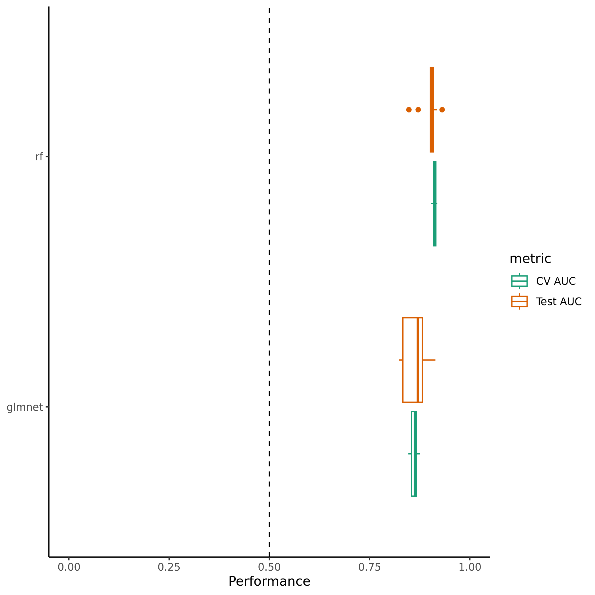
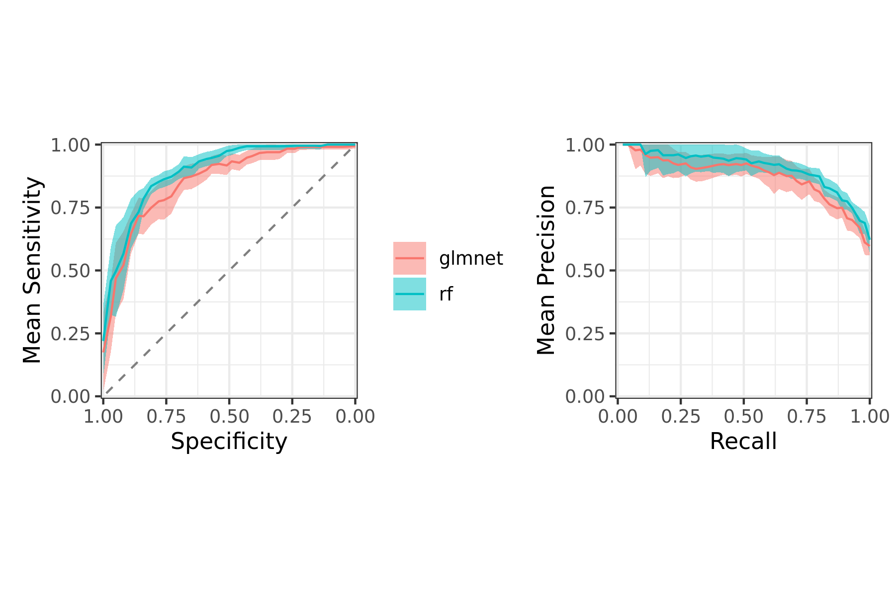
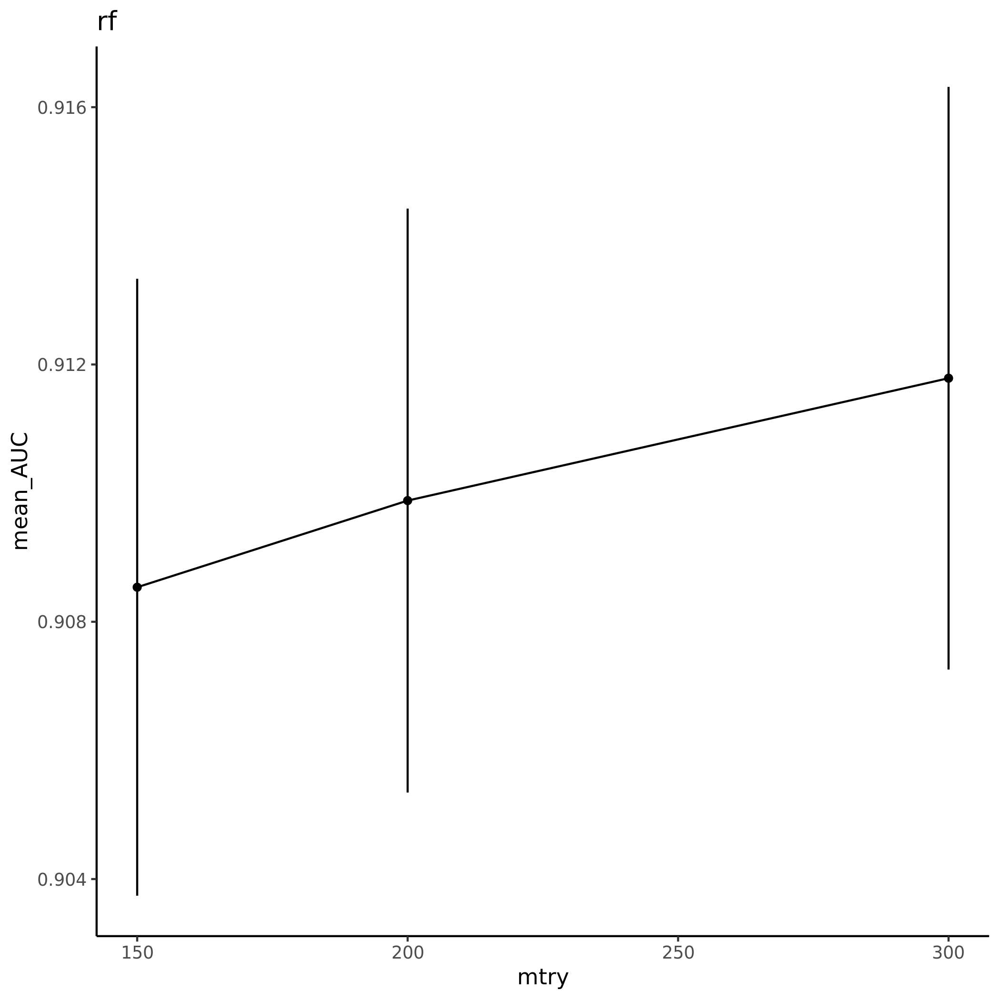
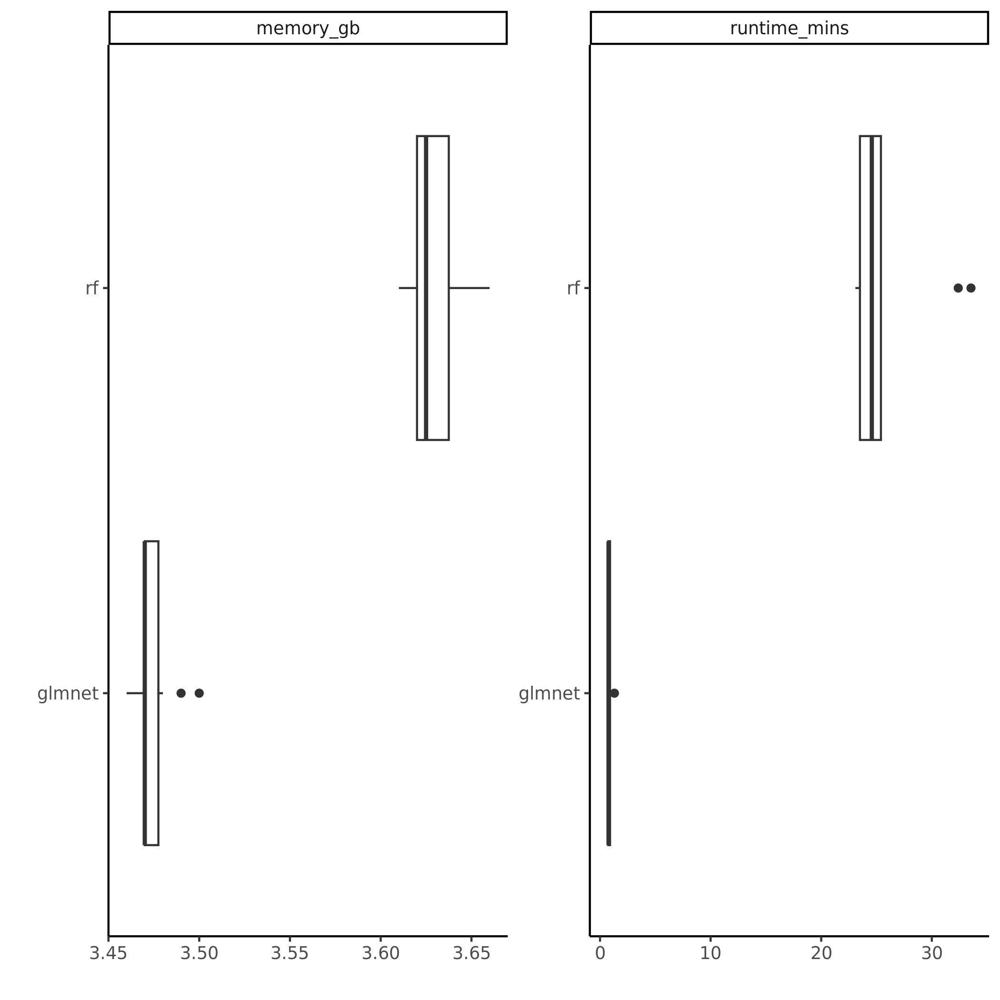

            

Machine learning algorithm(s) used: rf and glmnet.
Models were trained with 10 different random
partitions of the seq_SLURM_gl_rf dataset into training and
testing sets using 5-fold cross validation.
See [config/config.yaml](config/config.yaml) 
for the full configuration.

## Workflow

## Model Performance

## Hyperparameter Performance

## Feature Importance

## Memory Usage & Runtime

Each model training run was given 8 cores
for parallelization.

