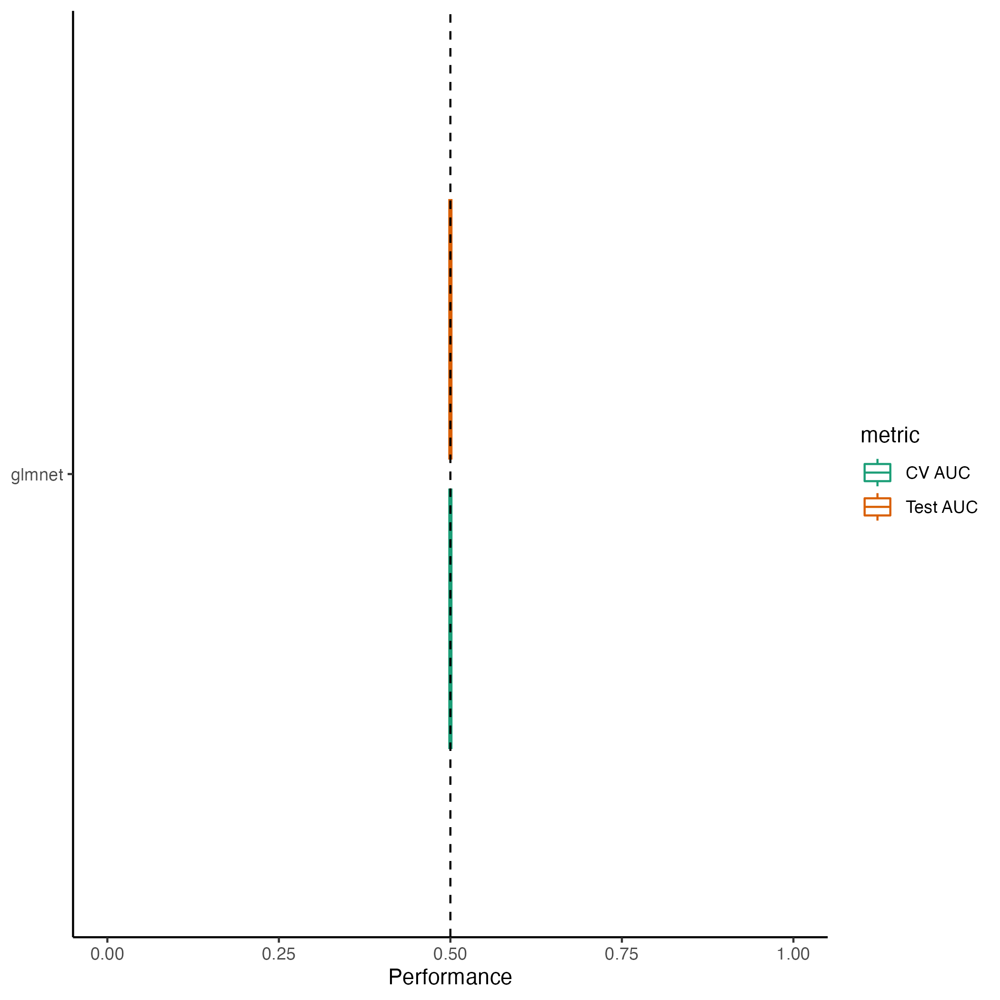
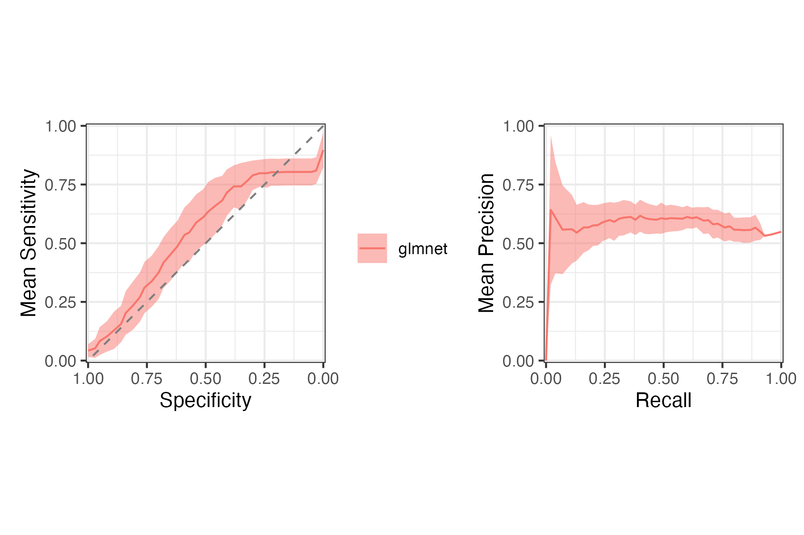
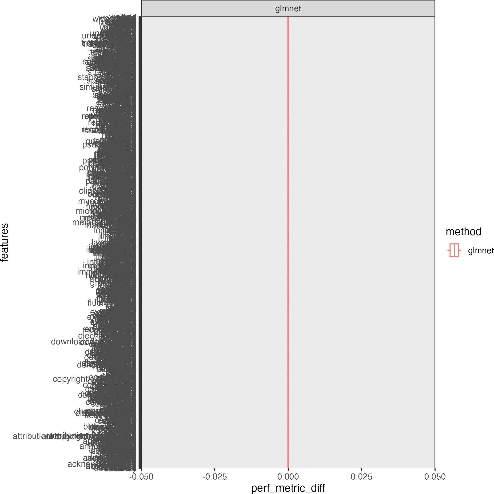
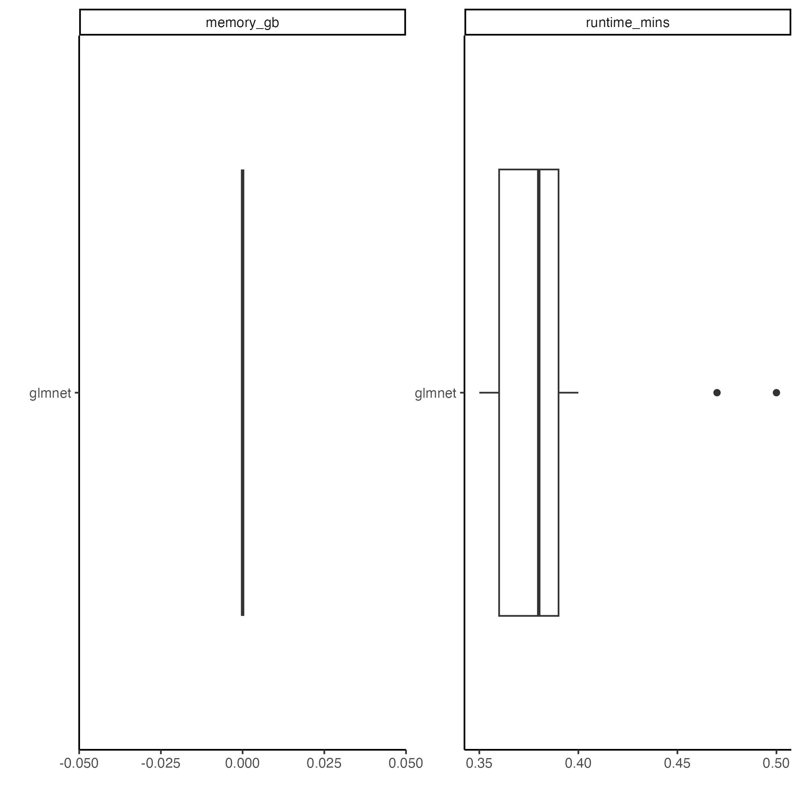

            

Machine learning algorithm(s) used: glmnet.
Models were trained with 100 different random
partitions of the seq_gl_100s dataset into training and
testing sets using 5-fold cross validation.
See [config/glmnet.yaml](config/glmnet.yaml) 
for the full configuration.

## Workflow

## Model Performance

## Hyperparameter Performance

## Feature Importance

## Memory Usage & Runtime

Each model training run was given 6 cores
for parallelization.

