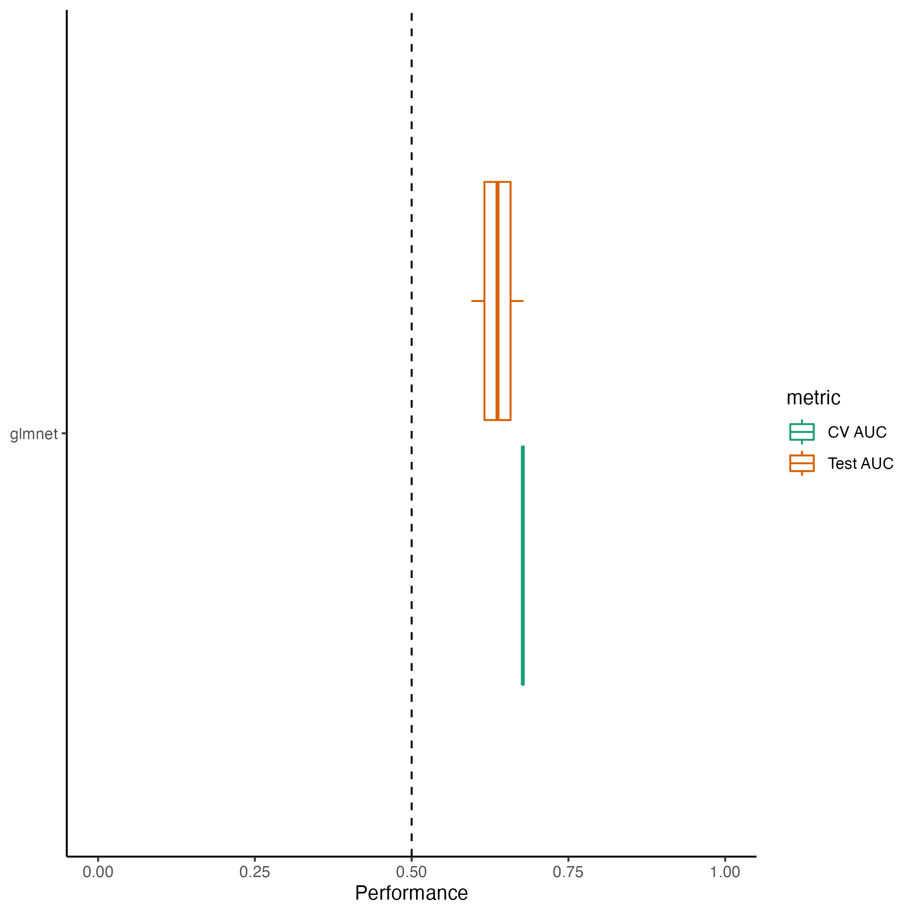
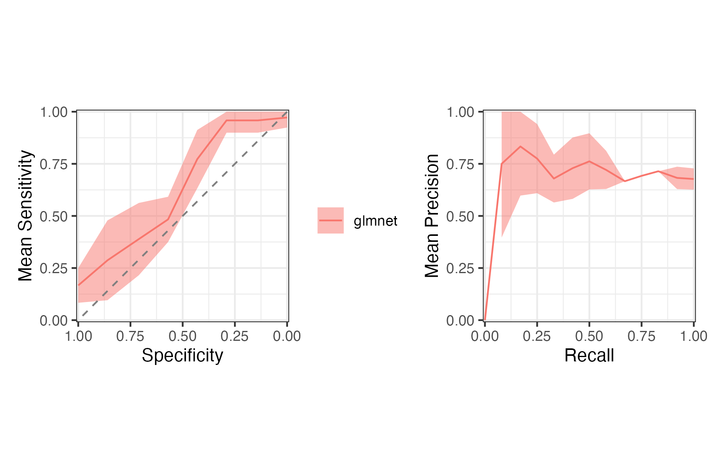
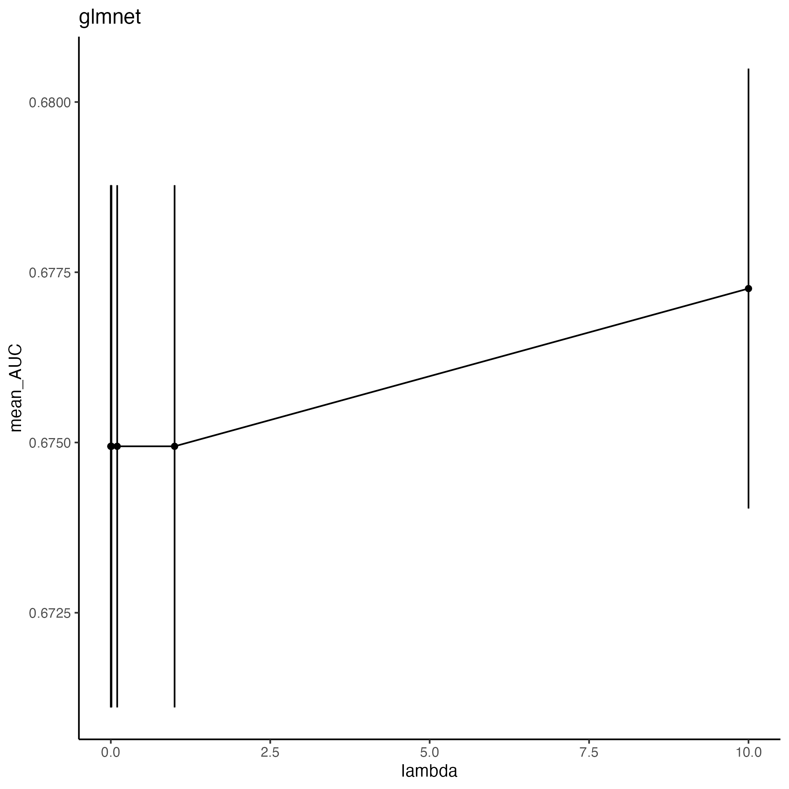
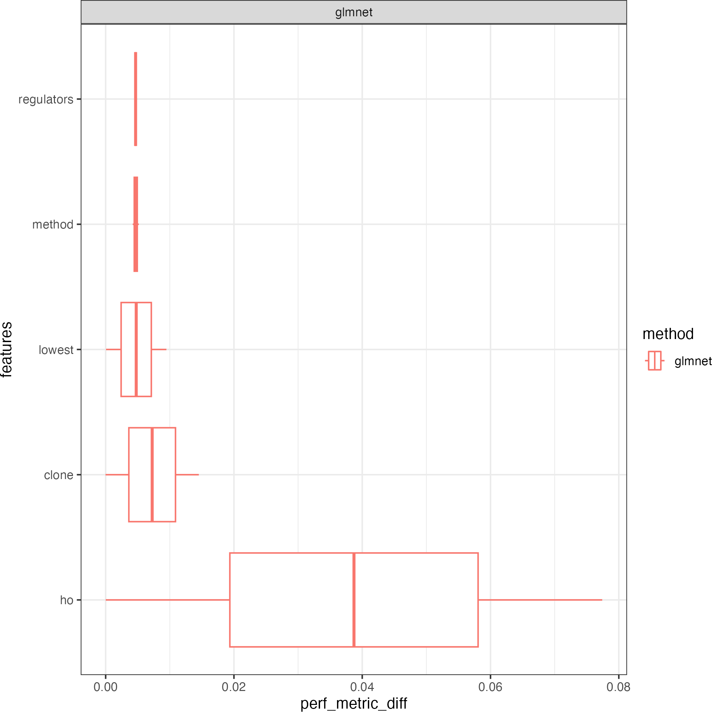
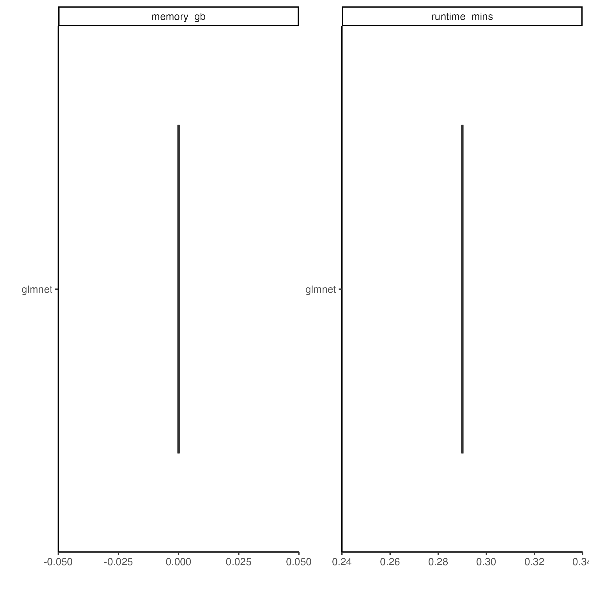

            

Machine learning algorithm(s) used: glmnet.
Models were trained with 2 different random
partitions of the words-mini dataset into training and
testing sets using 2-fold cross validation.
See [config/test.yaml](config/test.yaml) 
for the full configuration.

## Workflow

## Model Performance

## Hyperparameter Performance

## Feature Importance

## Memory Usage & Runtime

Each model training run was given 4 cores
for parallelization.

